## 气象数据

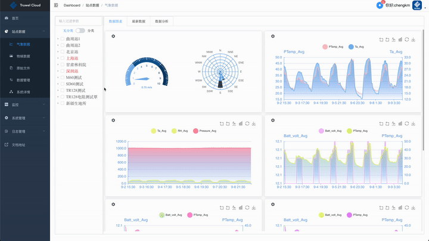

> **提示：** 可以拖拽中间区域:point_left:调整左右显示比例

#### 数据图表

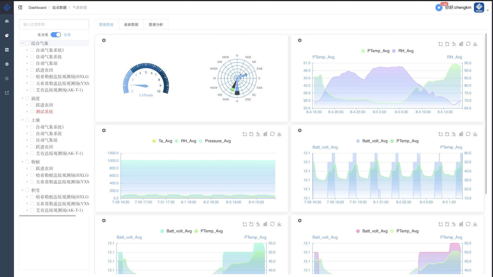

默认显示第1个表格前两个字段的最近24小时数据，可通过设置按钮进行参数和间隔时间的选择，通过点击左边树形列表进行站点切换显示

> **提示：** 树形列表可按照系统类型进行划分展示;支持参数中:cn:英:us:显示、单位显示

#### 最新数据

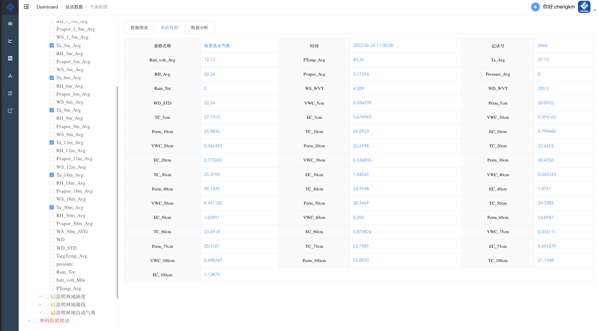

展示表格最新一条数据，同样可以通过点击左边树形列表进行站点切换显示

#### 数据分析

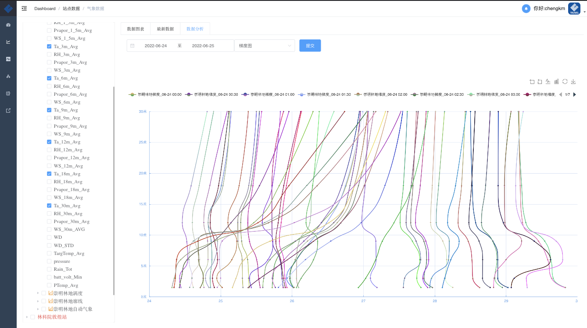

在这里可以对数据进行更细化的分析，包括`折线图`、`散点图`、`风玫瑰`、`梯度图`、`列表`，可以对数据进行列表下载或打包下载

> **提示：** 参数可以随意组合，支持跨站点数据分析

### 物候数据

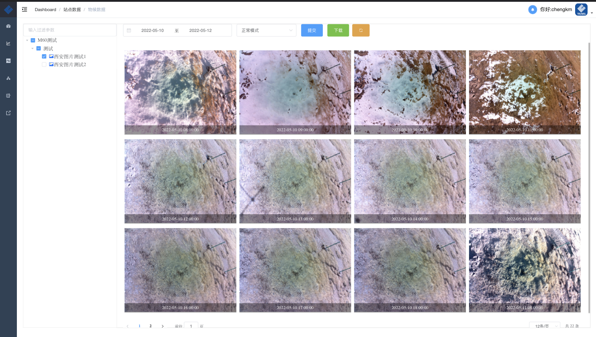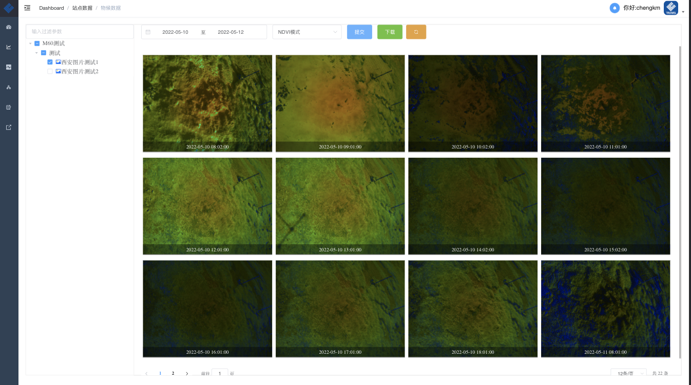

平台按照物候图片的类型进行分类展示，后期将增加GCC实时计算功能

> :camera: 目前支持`CCFC`、`NetCam`、`PhotoNet`等市面主流物候相机

### 点云数据

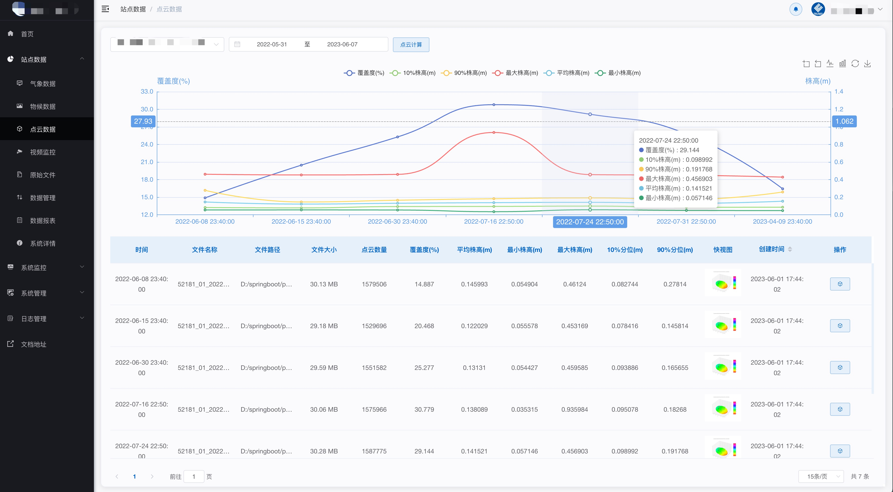

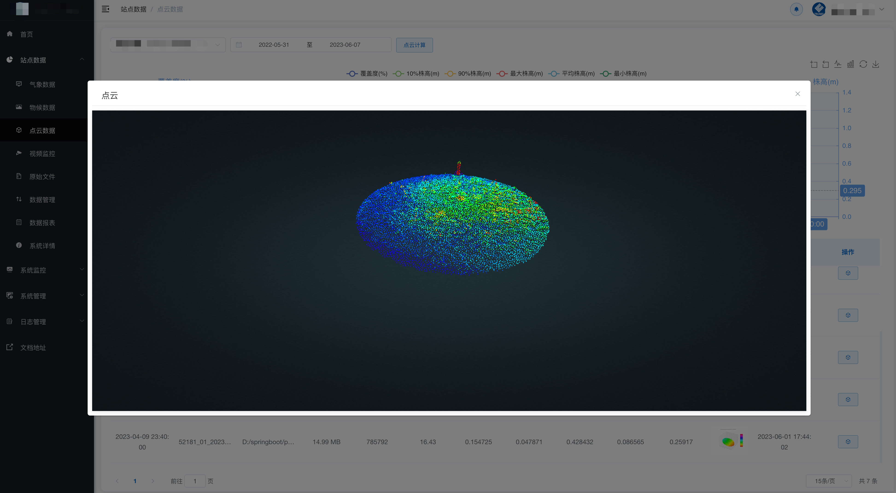

> :cloud: 目前仅支持`LAS`格式点云

### 视频监控

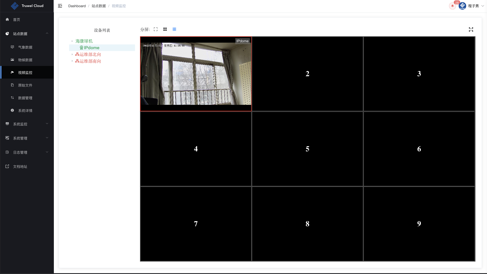

> **提示：** 可一、四、九分屏展示

### 原始文件

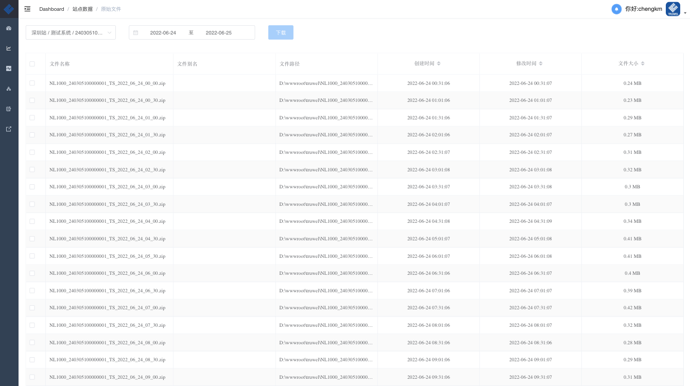

平台除了将对接数据直接入库外，不管原始文件是追加模式还是唯一模式都可以很方便地进行管理

### 数据管理

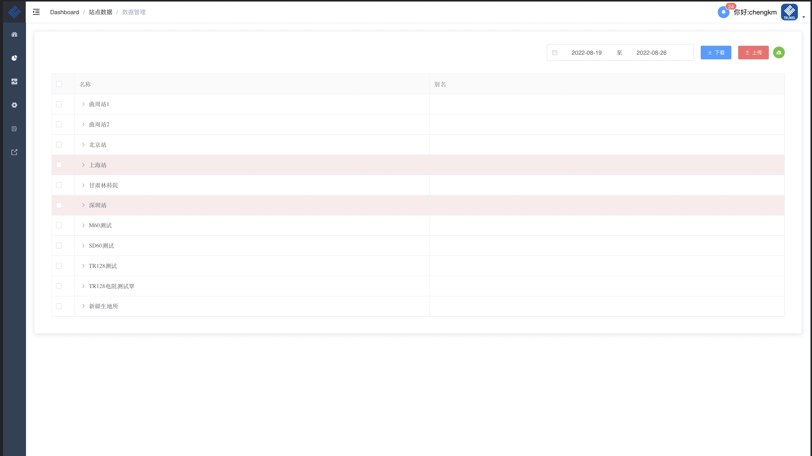

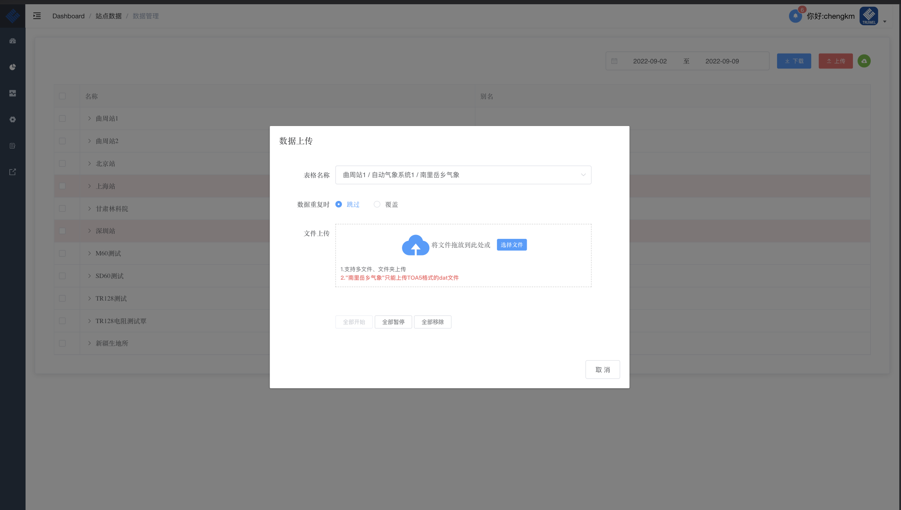

数据的:arrow_up:上传、:arrow_down:下载就在这里

> **提示：** 平台能够记住用户上次下载记录，方便之后进行一键下载:thumbsup:

### 数据报表

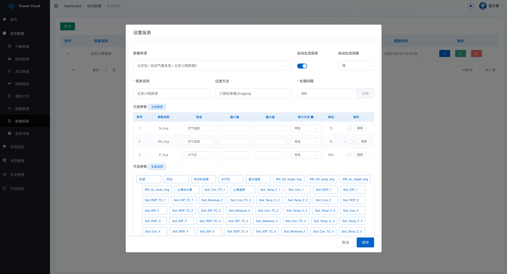

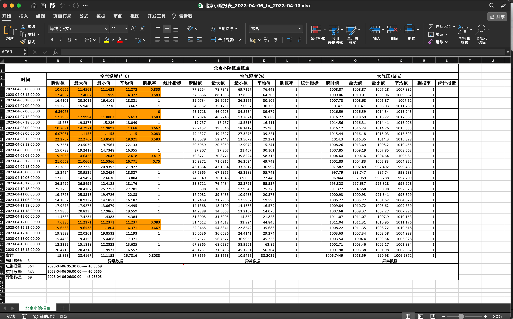

> **提示：** 可按周、月和季度定时生成:page_facing_up:

### 系统详情

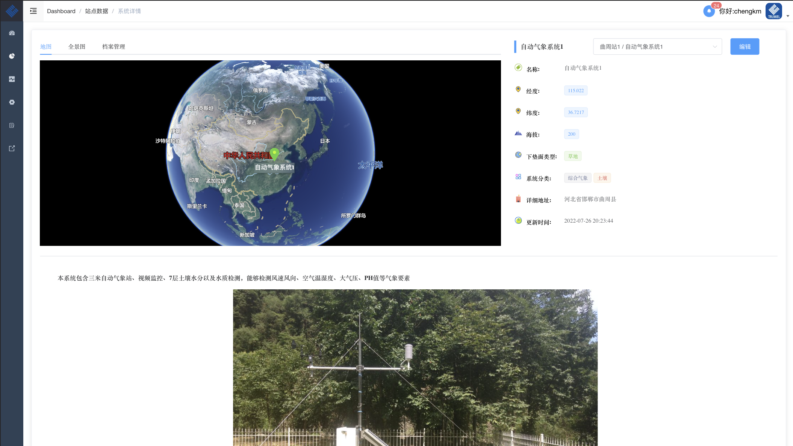

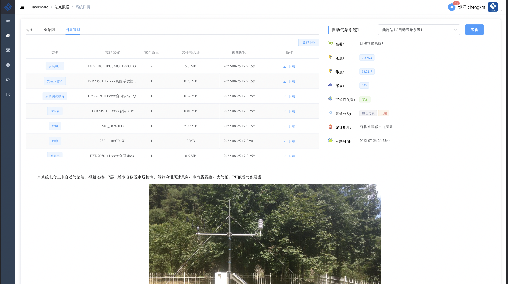

全景图/视频、地图、档案资料等多种方式进行展示
