### 气象监测

#### 数据图表

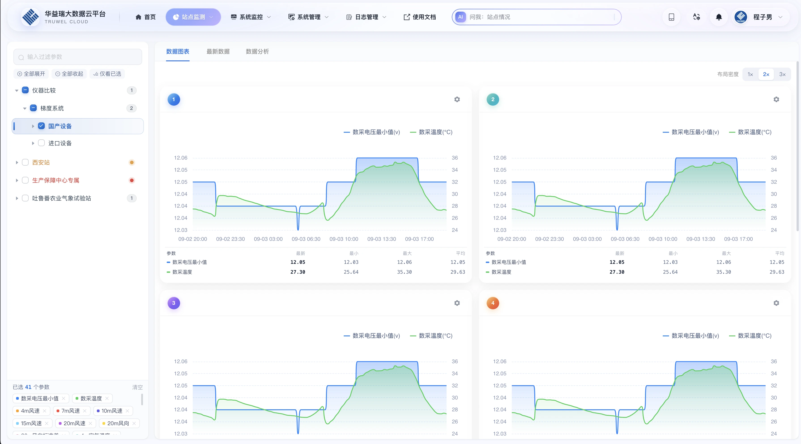

以格子图形式集中展示站点数据，支持自定义观测参数与统计间隔。

#### 最新数据

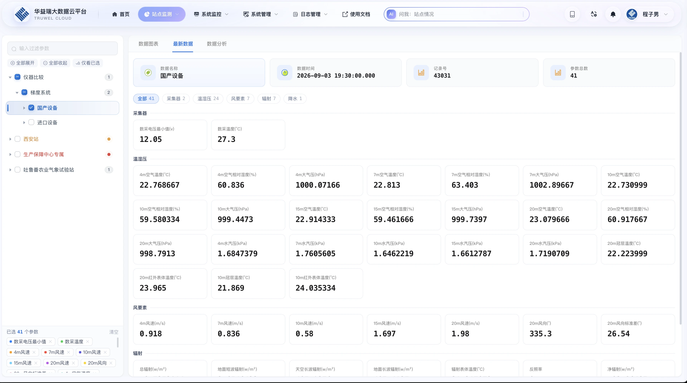

展示各数据表的最新一条观测记录。

#### 数据分析

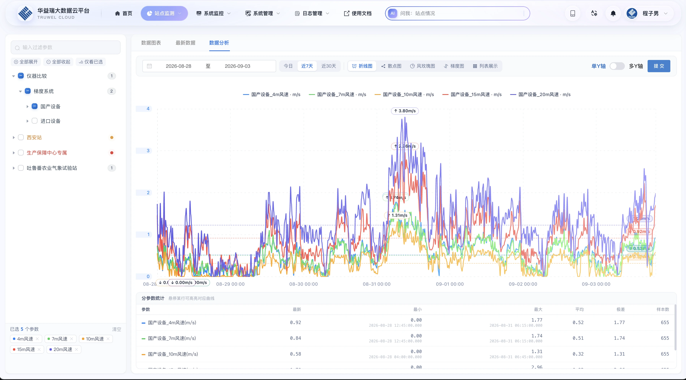

提供更细粒度的数据分析能力，支持`折线图`、`散点图`、`风玫瑰图`、`梯度图`与`列表`等展示形式。

> **提示：** 观测参数支持任意组合，并可进行跨站点对比分析。

### 数采设备

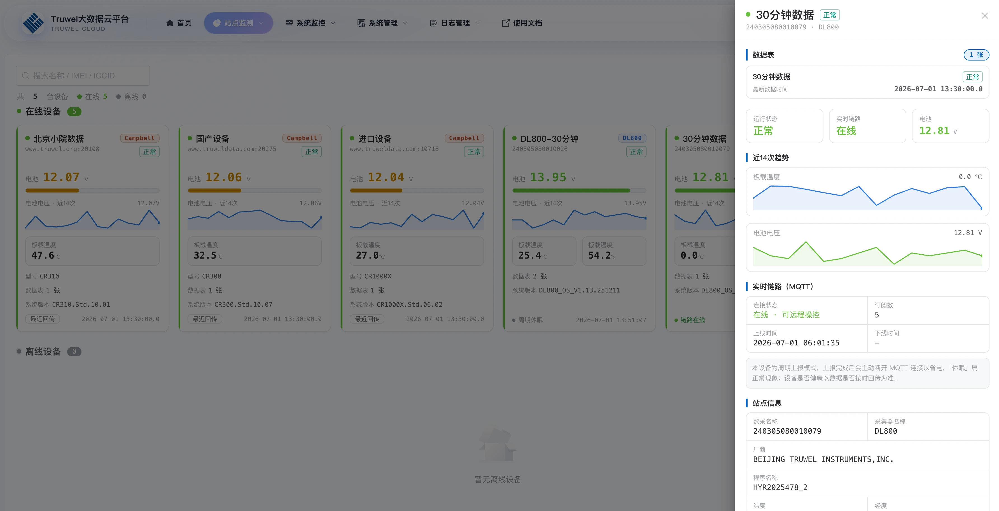

以卡片形式展示数采设备的在线状态、电池电压、板载温度与系统版本，并可查看实时链路状态、近期运行趋势及站点档案信息。

### 物候监测

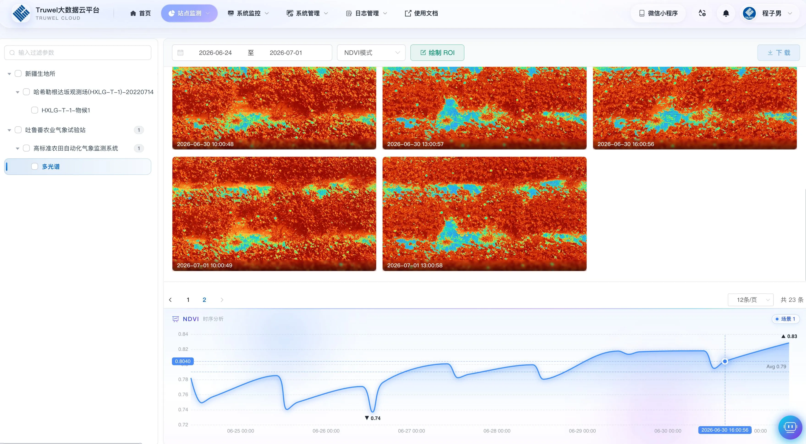

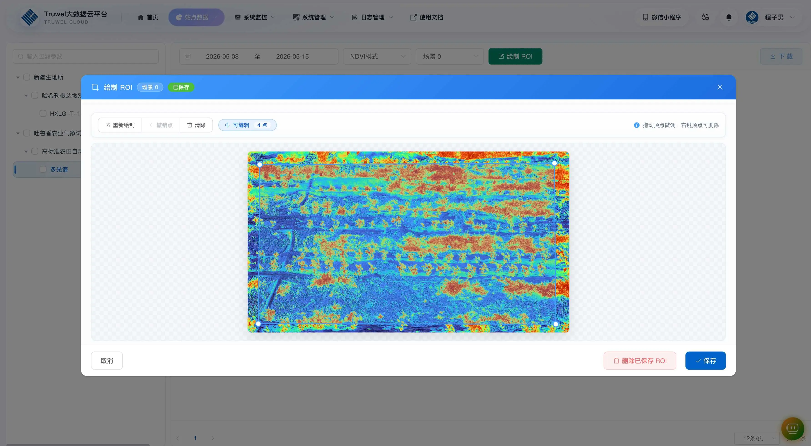

平台按物候图片类型分类展示，支持 NDVI、GNDVI、NDRE、OSAVI、LCI 等植被指数计算。

### 点云监测

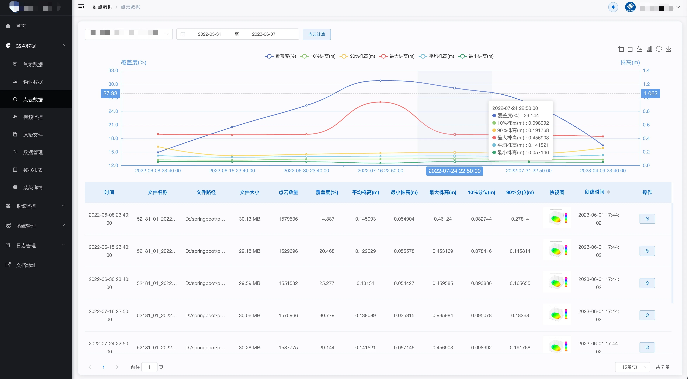

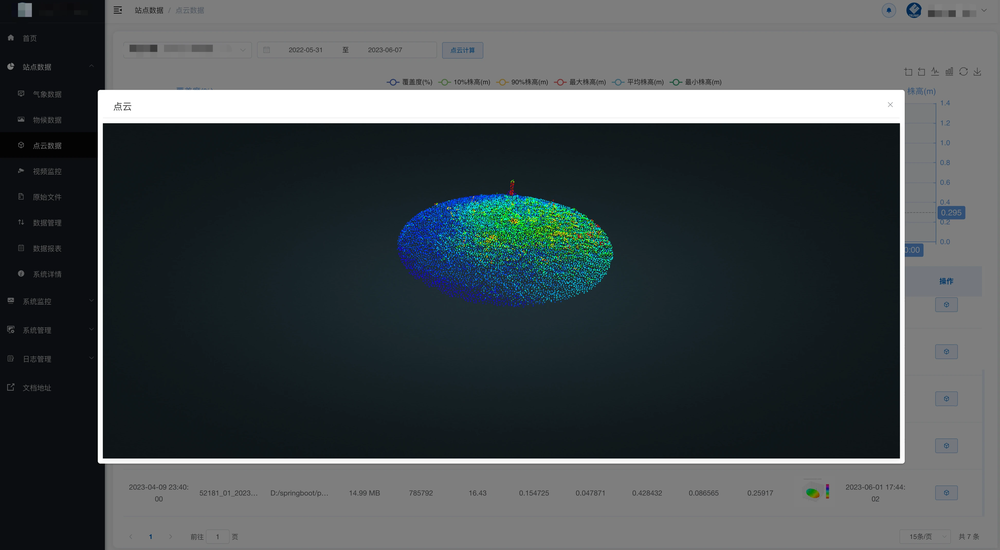

### 视频监测

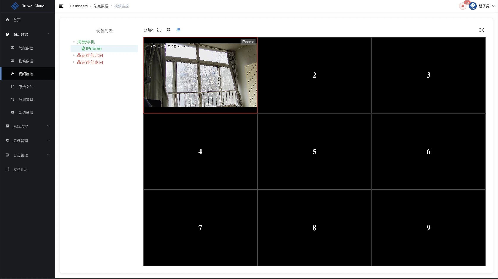

> **提示：** 支持一分屏、四分屏与九分屏展示。

### 数据下载

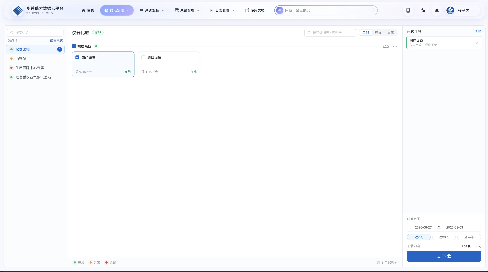

按站点与数据表勾选下载范围，支持自定义时间区间或近 7 天、近 30 天、近半年等快捷区间，批量导出观测数据。

### 数据报表

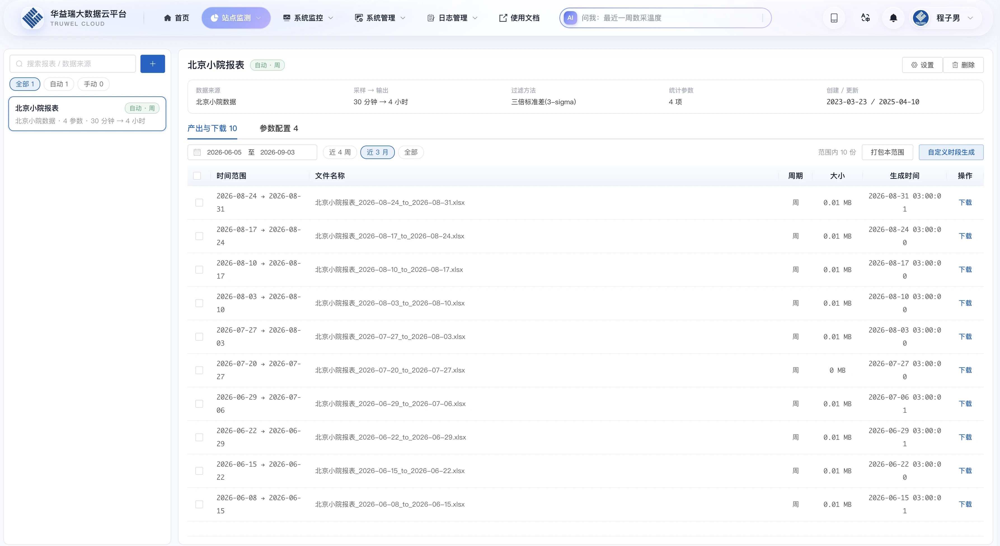

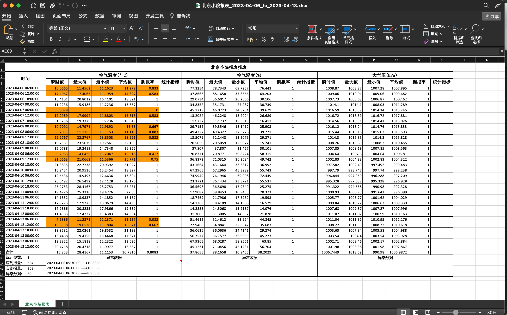

> **提示：** 支持按周、月、季度定时生成报表。

### 传输监测

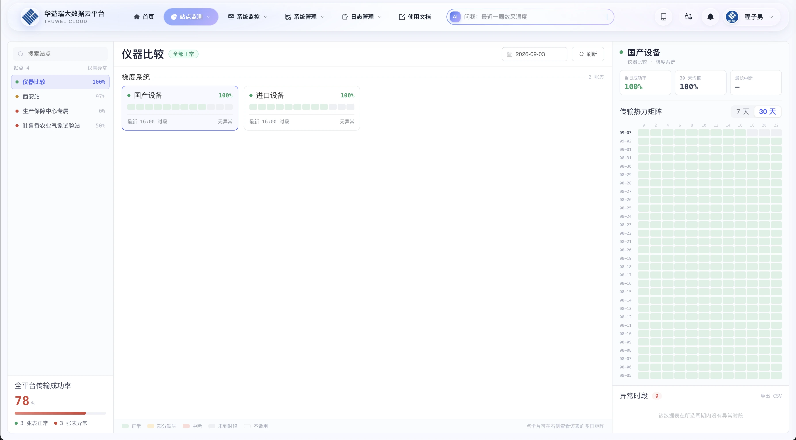

实时监控各站点的数据传输状态。

### 系统详情

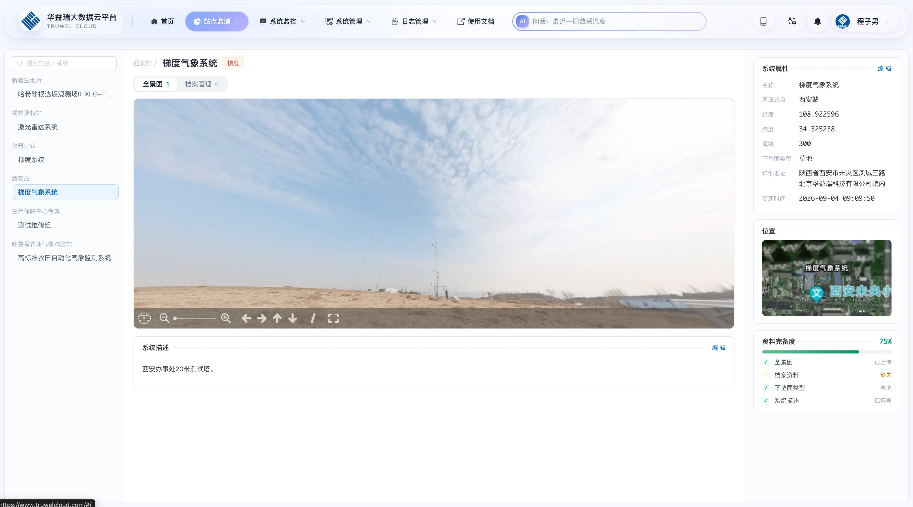

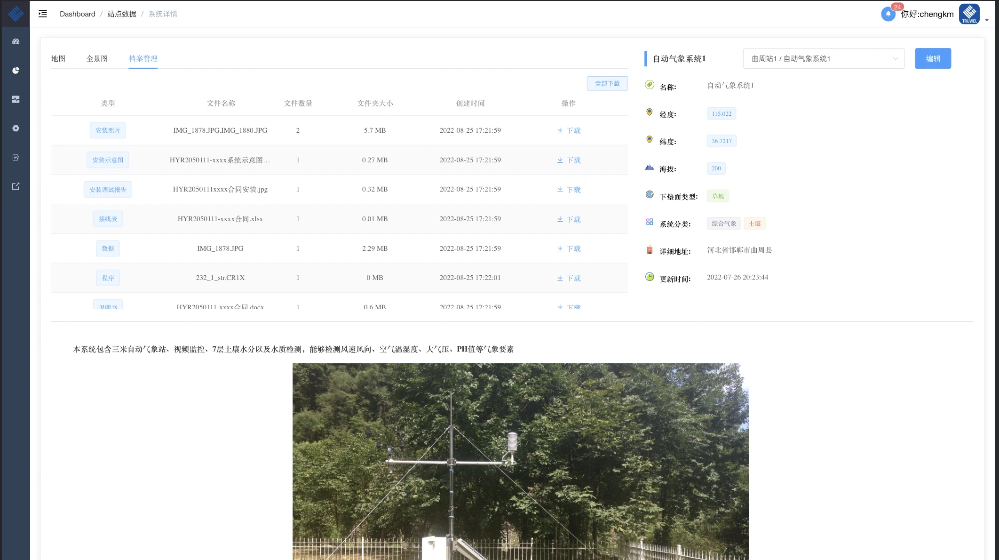

支持全景图、视频、地图与档案资料等多种展示方式。

### 异常检测

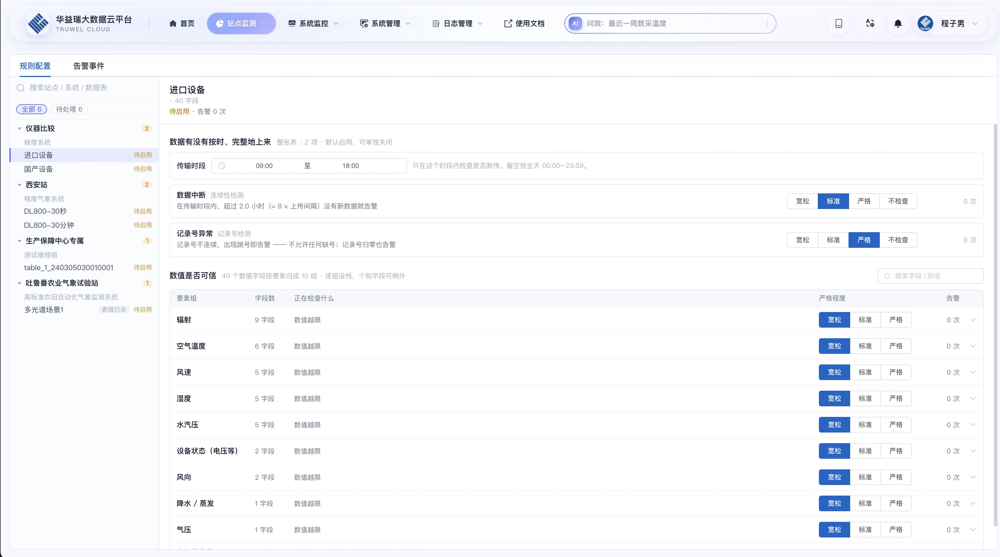

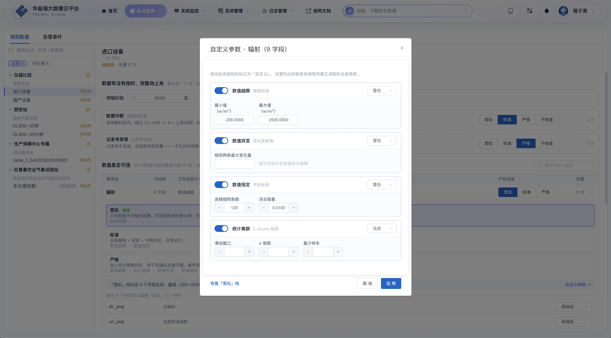

提供多维度、细粒度的异常检测规则配置。
