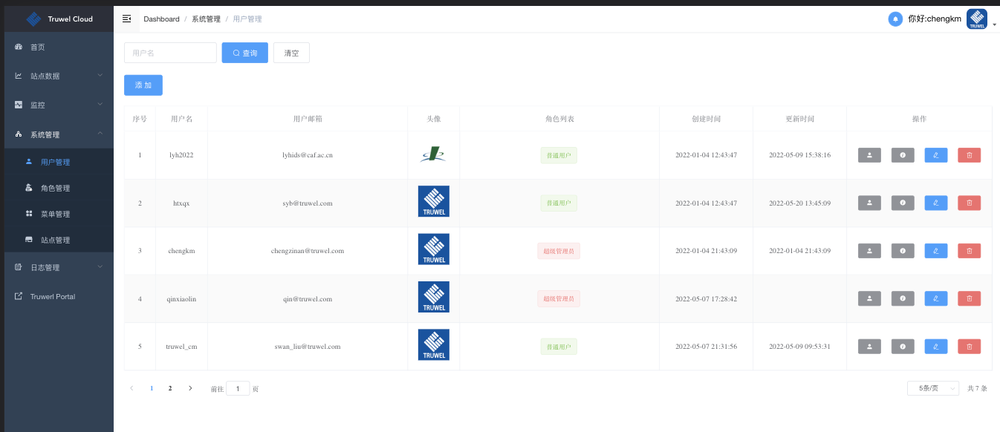
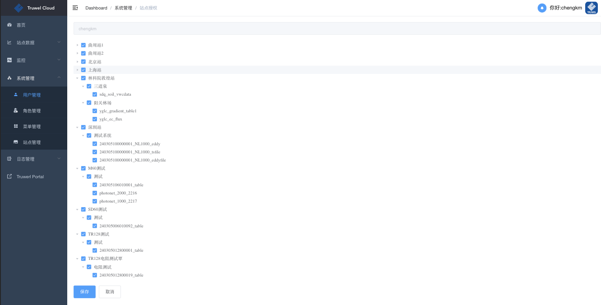
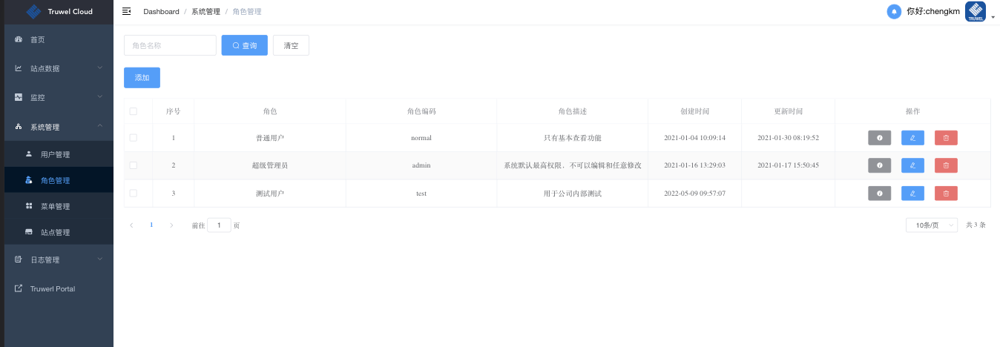
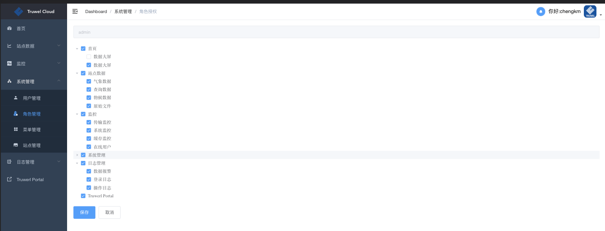
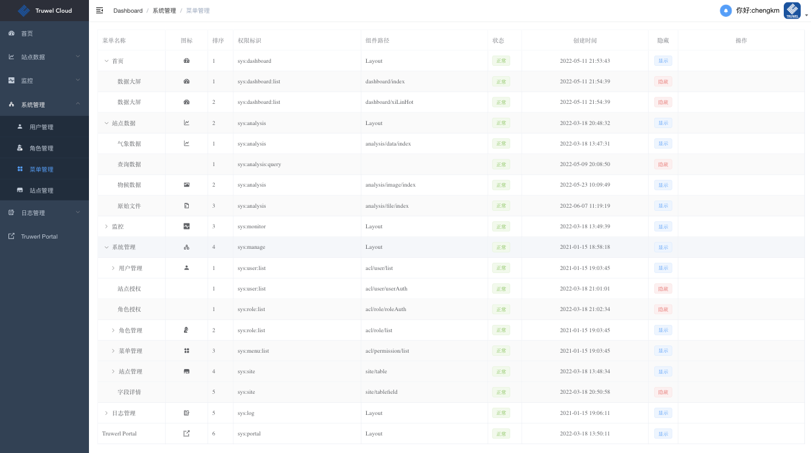
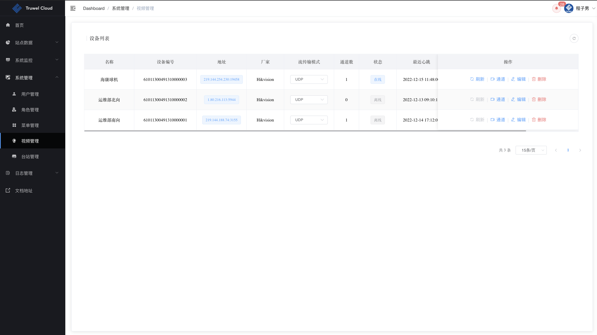
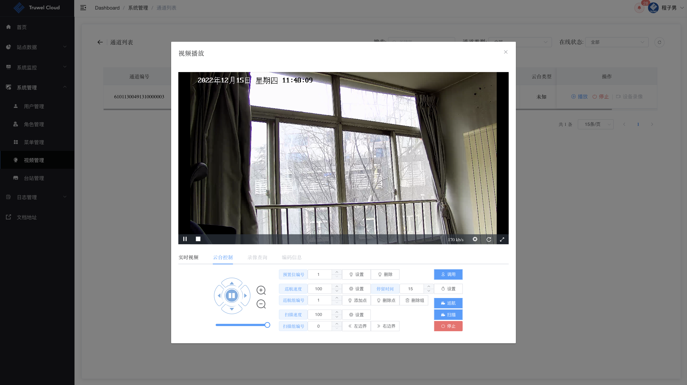
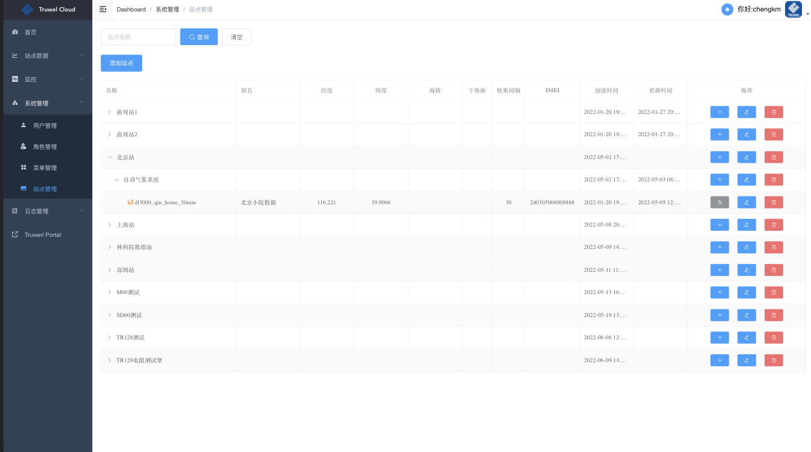
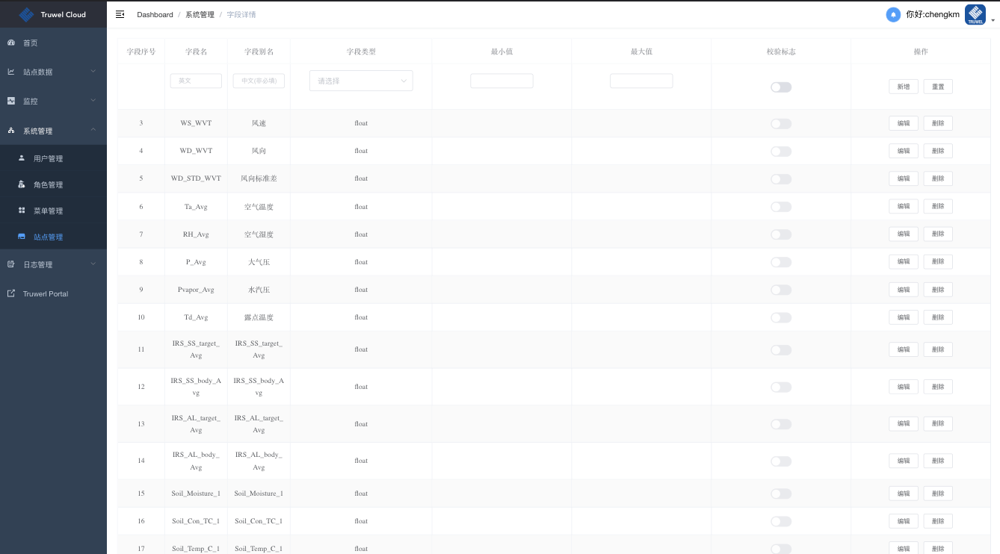

### 用户管理

> 一个用户可以分配多个角色

### 角色管理

### 菜单管理

可以对平台菜单栏内容进行更改，包括名称、顺序、图标等

### 视频管理

管理监控设备、视频通道、控制云台等

### 站点管理

平台按照`站点`->`系统`->`数据表`三级进行分类，在`数据表`层可继续细分`数据`、`图片`和`文件`三大类

> 平台目前支持`campbell数据`、`mqtt消息`、`本地文件`等多种市面主流数据类型，其他类型可根据需求进行定制开发
