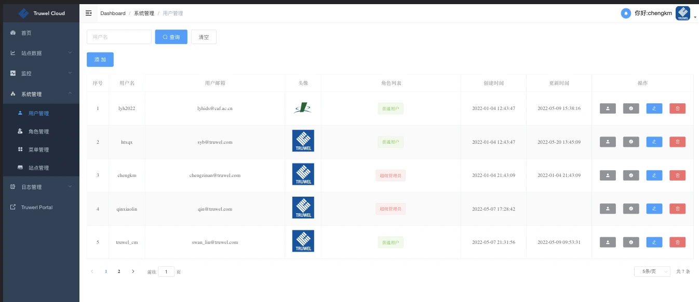
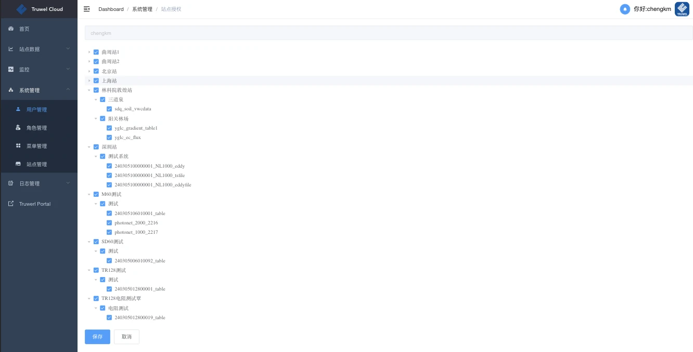
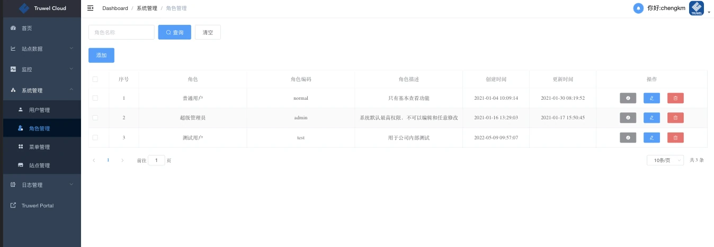
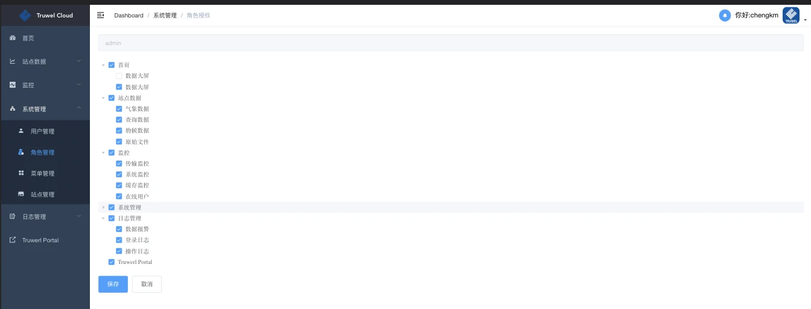
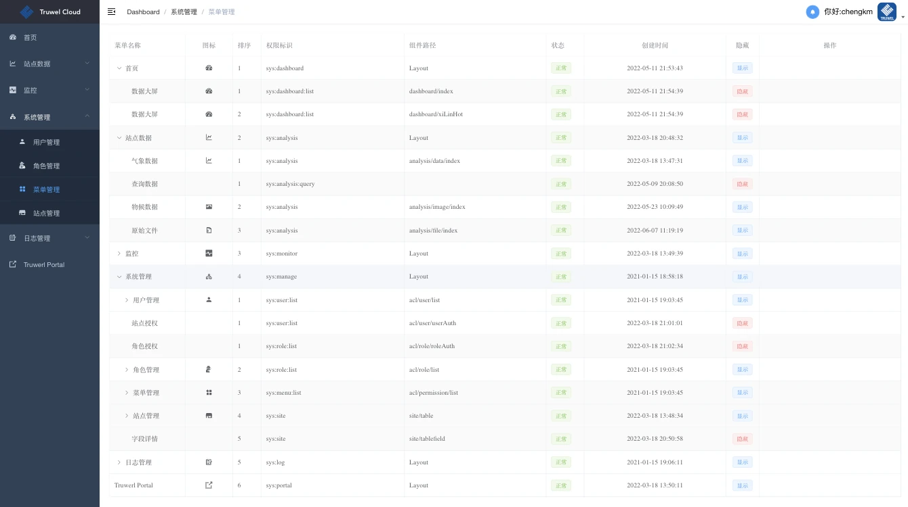
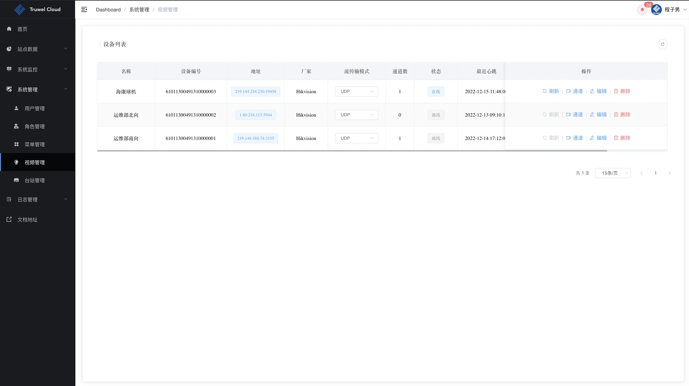
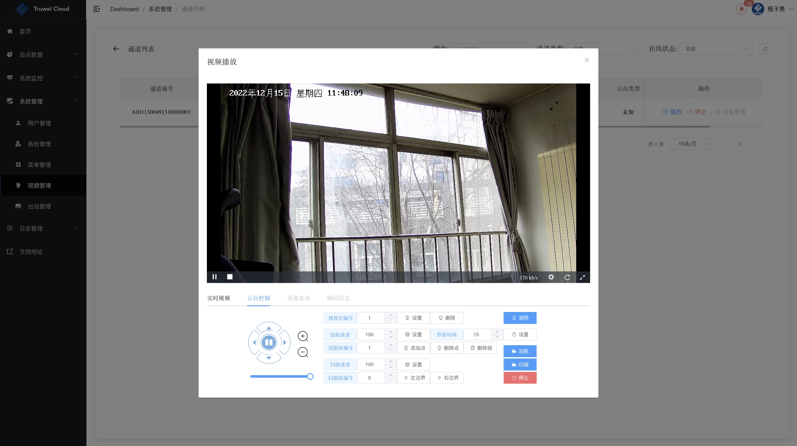
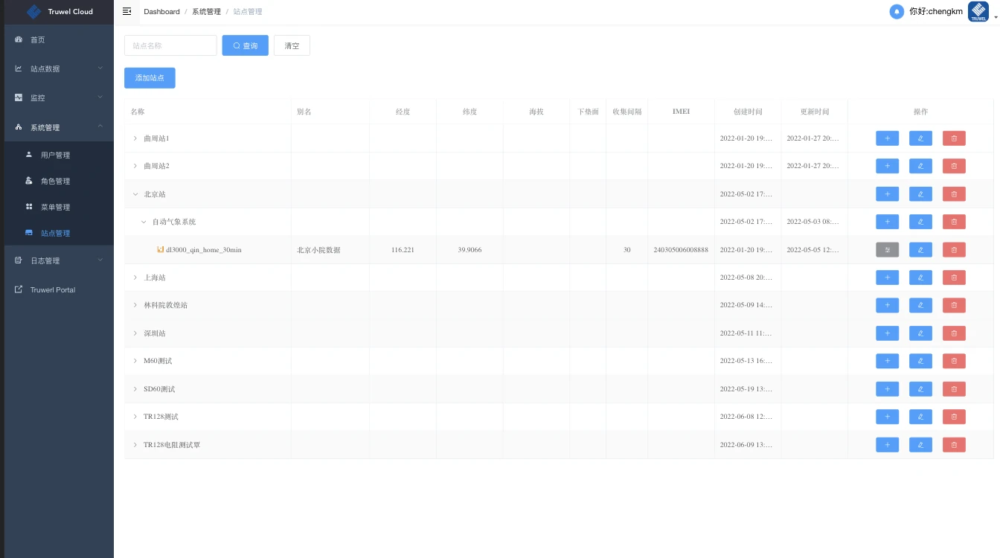
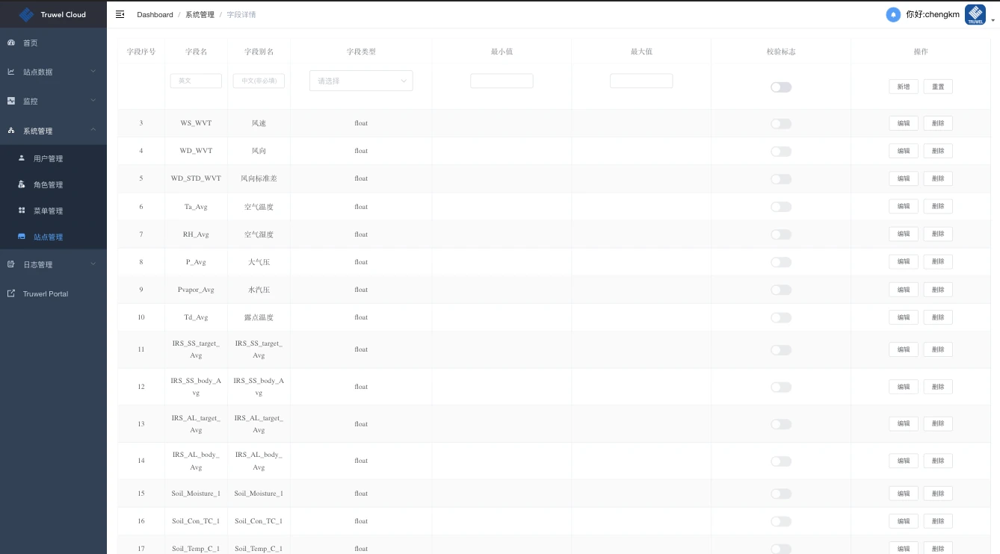

### 用户管理

> 单个用户可分配多个角色。

### 角色管理

### 菜单管理

支持修改平台菜单的名称、排序与图标等属性。

### 视频管理

用于管理监控设备与视频通道，并支持云台控制。

### 站点管理

平台按`站点` → `系统` → `数据表`三级结构组织数据，`数据表`层下可继续划分为`数据`、`图片`与`文件`三类。

> 平台已支持 `Campbell 数据`、`MQTT 消息`、`本地文件`等主流数据类型，其他类型可按需定制开发。
