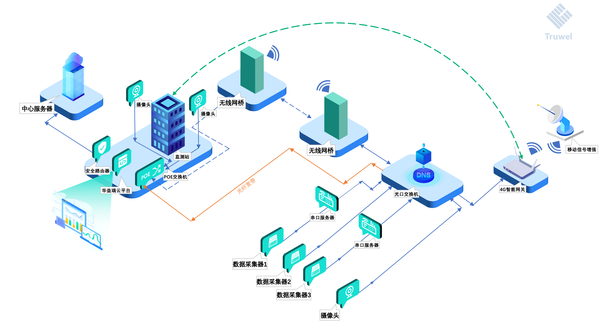

`TruwelCloud`是一套有效整合了数据、图像、视频等各类型业务数据,实现了完整的数据收集、传输、存储、备份、分析和展示,形成了集约、高效的全过程分布式系统SAAS解决方案。

- <Badge text="前端页面响应式布局"/>
- <Badge text="支持微信小程序查询"/>
- <Badge text="支持LAS点云数据接入"/>
- <Badge text="支持`MQTT`消息接入"/>
- <Badge text="支持`北斗三号`消息接入"/>
- <Badge text="支持数据报表一键导出"/>
- <Badge text="支持按钮级别数据权限"/>
- <Badge text="支持国内外数采数据接入"/>
- <Badge text="保证用户之间绝对的权限隔离"/>
- <Badge text="支持物候照片及数据文件管理"/>
- <Badge text="接入`Deepseek`实现对话即服务"/>
- <Badge text="应用接口符合`RESTful API`规范"/>
- <Badge text="支持符合国标GB28181监控视频接入"/>
- <Badge text="可部署在用户`Windows`/`Linux`服务器"/>
- <Badge text="采用容器化、分布式、大数据架构体系构建"/>
- <Badge text="支持`微信`、`QQ`、`钉钉`、`短信`、`邮件`等多种方式的告警信息推送"/>
