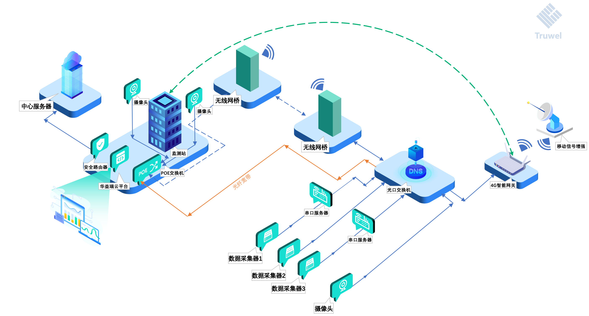

`TruwelCloud` 是一套面向多源异构数据（结构化数据、图像、视频）的 `SaaS` 级解决方案。系统实现了业务数据全流程的集约化治理，涵盖数据采集接入、弹性传输存储、容灾备份及深度分析展示，确保业务的高效流转与数据安全。

- <Badge text="支持微信小程序查询"/>
- <Badge text="支持 LAS 点云数据接入"/>
- <Badge text="支持 MQTT 消息接入"/>
- <Badge text="支持 北斗三号 消息接入"/>
- <Badge text="支持数据报表一键导出"/>
- <Badge text="支持按钮级别数据权限"/>
- <Badge text="支持国内外数采数据接入"/>
- <Badge text="保证用户之间绝对的权限隔离"/>
- <Badge text="支持物候照片及数据文件管理"/>
- <Badge text="接入 DeepSeek 实现对话即服务"/>
- <Badge text="应用接口符合 RESTful API 规范"/>
- <Badge text="支持符合国标 GB28181 监控视频接入"/>
- <Badge text="可部署在用户 Windows / Linux 服务器"/>
- <Badge text="采用容器化、分布式、大数据架构体系构建"/>
- <Badge text="支持 微信、钉钉、短信、邮件等多种方式的告警信息推送"/>
