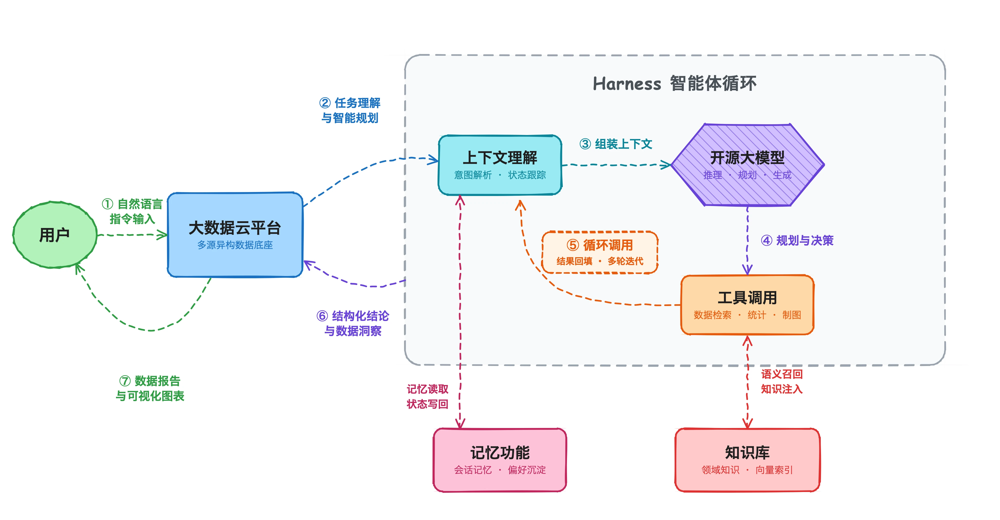
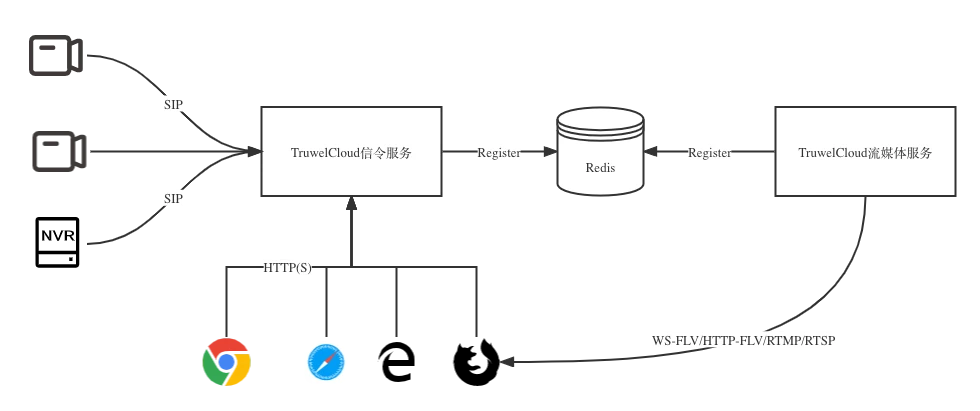
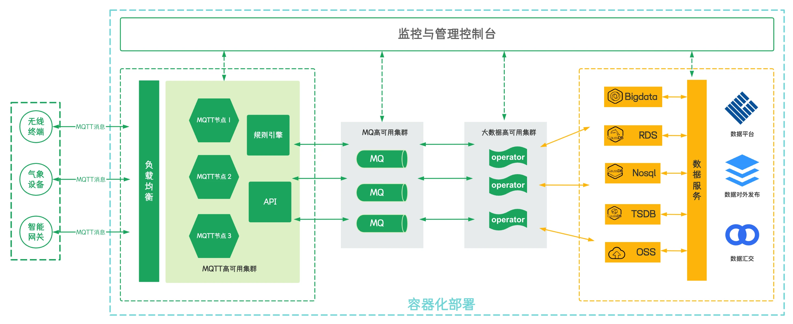

## 智能体

`Harness` 是华益瑞自主研发的智能体运行框架。框架以上下文理解为入口，由开源大模型完成推理与规划，经工具调用访问大数据云平台的观测数据，并通过循环调用实现结果回填与多轮迭代；记忆功能负责会话状态的读取与写回，知识库为推理过程提供领域知识的语义召回。

## 视频

视频监控的`信令服务`与`流媒体服务`均基于成熟框架自主搭建，全链路数据不经第三方平台中转，保障用户监控数据安全。

## 消息

采用流式消息处理架构，各组件均以容器化、分布式方式部署，可支撑`海量`、`高频`数据的接入与实时处理。

## 存储

采用分布式时序数据库与 OSS 对象存储承载`海量`、`高频`数据，通过`三副本`冗余与高压缩比存储，兼顾数据可靠性与存储效率。
